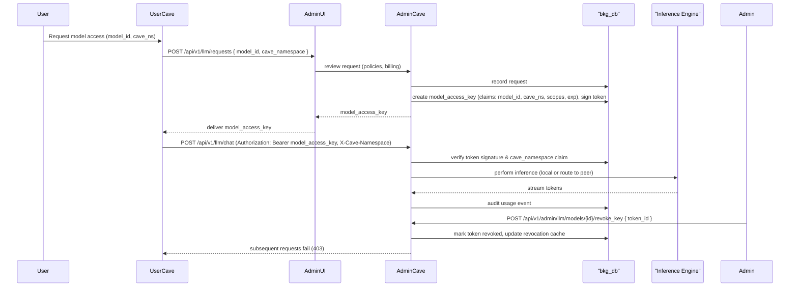

# docs/architecture.md

Version: 1.0  
Letzte Änderung: 2025-10-18  
Maintainer: @bkgoder

Übersicht
---------
Dieses Dokument beschreibt die Systemarchitektur der BKG‑Plattform (CAVE) auf hoher Ebene, die wichtigsten Komponenten, die Interaktionen zwischen ihnen und typische Laufzeitabläufe (Sequenzdiagramme in Mermaid). Ziel ist: schnelle Orientierung für Entwickler, Reviewer und CI‑Checks.

Kernkomponenten
---------------
- `service/cave` (CAVE Kernel): Verantwortlich für Sandbox‑Lifecycle (create/start/exec/stop), Isolation (namespaces, cgroups v2, seccomp), Workspace Overlay und API‑Key‑Erstellung. Exponiert REST + WebSocket + MCP `/mcp` Endpunkte.
- `bkg_db`: Persistente Postgres‑ähnliche DB mit RLS, speichert Projekte, sandboxes, api_keys (verschlüsselt), model_registry, peers, policies, audit_events.
- `bkg_llm` (Admin only): LLM Inference Adapter & Model Registry (download, verify, cache). Exponiert Admin‑LLM Endpoints.
- `plugin_p2p`: P2P Netzwerkschicht (libp2p‑like) für modellchunks & metadata replication; opt‑in für Admin‑CAVEs.
- `web/admin` & `web/app`: React‑Based UI; Admin UI verwaltet peers, models, keys; App UI bietet Workflow‑Canvas, Chat‑Studio und Model‑Selector.
- `cli/cavectl`: Operator & Developer CLI (bkg init/add/exec/run/stop, peers, llm request-access).

Design‑Prinzipien
-----------------
- Clean‑Room: Konzepte aus Inspirations‑Repos werden übernommen, Code aber neu implementiert.
- Security‑by‑Default: seccomp, cgroups, AES‑256 at rest, mTLS intern.
- Modularität: Plugin‑Architecture; Adapter‑Trait garantiert swappable inference backends.
- Observability: OpenTelemetry, Prometheus Metriken, append‑only Audit Logs.

Sequenzdiagramme (Mermaid)
--------------------------

### 1) Sandbox Lifecycle (create → start → exec → stop)

```mermaid
sequenceDiagram
  participant User
  participant WebUI
  participant API as "BKG API"
  participant DB as "bkg_db"
  participant CAVE as "CAVE Kernel"

  User->>WebUI: Create sandbox (project, runtime, limits)
  WebUI->>API: POST /api/v1/sandboxes {project, runtime, name, limits}
  API->>DB: INSERT sandbox meta; generate api_key (encrypt AES-256)
  DB-->>API: sandbox_id, masked_api_key
  API->>WebUI: 201 Created { id, namespace, api_key(masked) }
  WebUI->>User: Display sandbox created & masked key

  User->>WebUI: Start sandbox
  WebUI->>API: POST /api/v1/sandboxes/{id}/start
  API->>CAVE: start sandbox (apply seccomp & cgroups profile)
  CAVE-->>API: started + metrics stream
  API->>WebUI: status running

  User->>WebUI: Exec command in sandbox
  WebUI->>API: POST /api/v1/sandboxes/{id}/exec {cmd/script}
  API->>CAVE: exec -> stream logs via WS
  CAVE-->>API: stream stdout/stderr/events
  API->>DB: append audit_event (exec)
  API->>WebUI: stream forwarded to user

  User->>WebUI: Stop sandbox
  WebUI->>API: POST /api/v1/sandboxes/{id}/stop
  API->>CAVE: stop -> release resources
  CAVE-->>API: stopped
  API->>DB: append audit_event (stop)
  API->>WebUI: confirmation
```

Erläuterung:
- Alle Aktionen gegen DB werden auditiert.  
- API‑Key wird AES‑256 verschlüsselt gespeichert; nur maskierte Version an UI zurückgegeben.  
- seccomp/cgroups Profile werden vom CAVE Kernel beim Start angewendet.

### 2) Model‑Access‑Key Flow (issue → use → revoke)



Komponenten‑Interaktionsmuster
-----------------------------
- Das API‑Gateway validiert Auth, Rate‑Limits und routet zu Services. Gateway konfiguriert `rate_limit_default` basierend auf RBAC‑Tabelle.  
- Services exportieren `/healthz` und `/metrics` für K8s probes.  
- Model Downloader führt checksum + signature verification vor dem Caching aus; Verification läuft in isolierter CAVE.

Deployment‑Beispiel (Kubernetes)
-------------------------------
- Stateful DB als Postgres cluster (managed) mit RLS und encrypted storage.  
- CAVE‑Controller als Deployment + HPA, mit PodSecurityPolicy / seccomp profile.  
- Admin‑CAVE Nodes optional in trusted pool (node selector) für GPU/secure HW.  
- Helm chart exposes values for `operator_ca_secret`, `cosign_key_secret`, `otel_sampling_rate`.

Operative Hinweise
------------------
- `CAVE_OTEL_SAMPLING_RATE` ist runtime konfigurierbar; setze in Prod < 1.0.  
- CI‑Jobs: `make api-schema`, `ajv validate`, `make sbom && make slsa` und sign SBOM with `cosign`.  
- Lockfiles (Cargo.lock, package-lock.json) müssen committed werden; PRs ohne reproduzierbaren lockfile state werden blockiert.

SPDX-License-Identifier: Apache-2.0