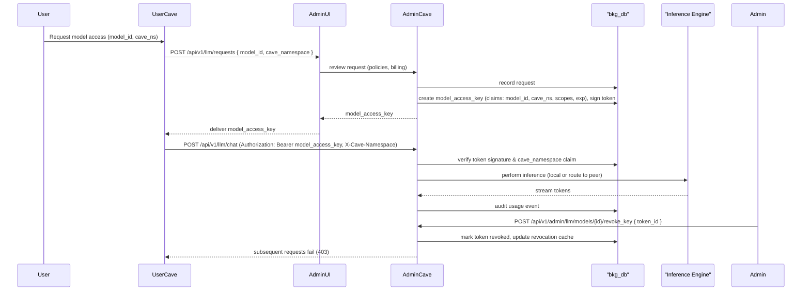

# docs/architecture.md

Version: 1.0  
Letzte Änderung: 2025-10-18  
Maintainer: @bkgoder

Übersicht
---------
Dieses Dokument beschreibt die Systemarchitektur der BKG‑Plattform (CAVE) auf hoher Ebene, die wichtigsten Komponenten, die Interaktionen zwischen ihnen und typische Laufzeitabläufe (Sequenzdiagramme in Mermaid). Ziel ist: schnelle Orientierung für Entwickler, Reviewer und CI‑Checks.

Begleitende Richtlinien für LLM-Agenten (Sandbox Coding Agent, Admin-Orchestrator, Specialized Worker) sind in `AGENTS.md` dokumentiert.

Kernkomponenten
---------------
- `crates/cave-daemon`: Axum-basierter HTTP/MCP-Dienst. Bindet `CaveKernel` und `AuthService` ein, stellt `/api/v1/sandboxes*`, `/api/v1/auth/keys*`, `/healthz`, `/metrics` bereit und generiert via `utoipa` das OpenAPI-Schema (`scripts/generate_openapi.py`).
- `crates/cave-kernel`: Sandbox-Orchestrierung mit `ProcessSandboxRuntime`, OverlayFS, optionalen Bubblewrap-Namespaces, seccomp-Filterung sowie Audit-Log-Writer (`audit.rs`). Verwaltet Lifecycle und Ressourcengrenzen für jede Sandbox.
- `crates/bkg-db`: Persistenz-Layer (SQLite aktuell, Postgres/RLS geplant) für Sandboxes, Execution-Logs, API-Key-Metadaten, Rotationsevents und Audit-Artefakte. Wird direkt aus Kernel & Daemon konsumiert.
- `web/admin` & `web/app`: Next.js Frontends mit gemeinsamer API-Client-Schicht; nutzen die Daemon-Endpoints für Lifecycle, Telemetrie und Governance.
- `config/sandbox_config.toml` & `config/*`: Vorgabewerte für Limits sowie Sandbox- und Telemetrie-Policy.
- `scripts/generate_openapi.py`, `Makefile`: Hilfstools für Schema-Generierung, CI-Läufe und Supply-Chain-Artefakte.

Design‑Prinzipien
-----------------
- Clean‑Room: Konzepte aus Inspirations-Repos werden übernommen, Code aber neu implementiert. Siehe `docs/FEATURE_ORIGINS.md`.
- Innovation Tracking: Jede neue Architekturentscheidung wird mit Quelle, Tests & Reviewer dokumentiert.
- Security-by-Default: ProcessSandboxRuntime erzwingt Namespaces/cgroups/seccomp (sobald aktiviert), API-Keys werden gehasht gespeichert, Audit-Logs sind HMAC-signiert.
- Modularität: Kernel vs. Daemon vs. DB entkoppelt; Adapter-Traits ermöglichen austauschbare Runtimes und Inferenz-Backends.
- Observability & Compliance: OpenTelemetry-Sampling über `CAVE_OTEL_SAMPLING_RATE`, Prometheus `/metrics`, auditierbare JSONL-Logs.

Sequenzdiagramme (Mermaid)
--------------------------

### 1) Sandbox Lifecycle (create → start → exec → stop)

```mermaid
sequenceDiagram
  participant User
  participant WebUI
  participant API as "BKG API"
  participant DB as "bkg_db"
  participant CAVE as "CAVE Kernel"

  User->>WebUI: Create sandbox (project, runtime, limits)
  WebUI->>API: POST /api/v1/sandboxes {project, runtime, name, limits}
  API->>DB: INSERT sandbox meta; generate api_key (encrypt AES-256)
  DB-->>API: sandbox_id, masked_api_key
  API->>WebUI: 201 Created { id, namespace, api_key(masked) }
  WebUI->>User: Display sandbox created & masked key

  User->>WebUI: Start sandbox
  WebUI->>API: POST /api/v1/sandboxes/{id}/start
  API->>CAVE: start sandbox (apply seccomp & cgroups profile)
  CAVE-->>API: started + metrics stream
  API->>WebUI: status running

  User->>WebUI: Exec command in sandbox
  WebUI->>API: POST /api/v1/sandboxes/{id}/exec {cmd/script}
  API->>CAVE: exec -> stream logs via WS
  CAVE-->>API: stream stdout/stderr/events
  API->>DB: append audit_event (exec)
  API->>WebUI: stream forwarded to user

  User->>WebUI: Stop sandbox
  WebUI->>API: POST /api/v1/sandboxes/{id}/stop
  API->>CAVE: stop -> release resources
  CAVE-->>API: stopped
  API->>DB: append audit_event (stop)
  API->>WebUI: confirmation
```

Erläuterung:
- Alle Aktionen gegen DB werden auditiert.  
- API‑Key wird AES‑256 verschlüsselt gespeichert; nur maskierte Version an UI zurückgegeben.  
- seccomp/cgroups Profile werden vom CAVE Kernel beim Start angewendet.

### 2) Model‑Access‑Key Flow (issue → use → revoke)



Komponenten-Interaktionsmuster
------------------------------
- Axum-Router im Daemon injiziert `TraceLayer` für Request-Logging; `AuthService` erzwingt Bearer-Tokens (Admin/Namespace) und persistiert Nutzungstimestamps in `bkg-db`.
- `CaveKernel` kapselt Runtime-Operationen: erstellt Workspaces, berechnet Limits (Fallback auf Defaults) und nutzt `AuditLogWriter`, um JSONL-Ereignisse inkl. HMAC-Signatur zu appendieren.
- `Database::connect` entscheidet anhand `BKG_DB_DSN`/`BKG_DB_PATH` über SQLite vs. Postgres und führt Migrationen idempotent aus.
- `ApiDoc` (`utoipa`) synchronisiert alle Pfade & Schemas; CI ruft `make api-schema` und `openapi-cli validate` auf, um Drift zu verhindern.
- Optionaler Rotation-Webhook: `AuthService::rotate_key` persistiert Outbox-Events, Signaturen werden per `CAVE_ROTATION_WEBHOOK_SECRET` berechnet und über `/api/v1/auth/keys/rotated` verifiziert.

Deployment‑Beispiel (Kubernetes)
-------------------------------
- Stateful DB als Postgres cluster (managed) mit RLS und encrypted storage.  
- CAVE‑Controller als Deployment + HPA, mit PodSecurityPolicy / seccomp profile.  
- Admin‑CAVE Nodes optional in trusted pool (node selector) für GPU/secure HW.  
- Helm chart exposes values for `operator_ca_secret`, `cosign_key_secret`, `otel_sampling_rate`.

Operative Hinweise
------------------
- `CAVE_OTEL_SAMPLING_RATE` wird beim Start eingelesen; ungültige Werte werden geklemmt und mit Warnung geloggt.
- Default-Limits (`ResourceLimits::default`) können via `CAVE_DEFAULT_*` überschrieben werden; Audit-Logs aktivierst du mit `CAVE_AUDIT_LOG_ENABLED=true` und optionalem `CAVE_AUDIT_LOG_HMAC_KEY` (Base64, ohne Padding).
- SQLite-Fallback nutzt `BKG_DB_PATH`; Produktionsdeployments setzen `BKG_DB_DSN` (Postgres) und deaktivieren `BKG_DB_PATH`.
- Bubblewrap ist optional: wenn nicht installiert und `CAVE_ISOLATION_NO_FALLBACK=true`, startet der Kernel keine Namespaces. Stelle sicher, dass `CAVE_BWRAP_PATH` & `CAVE_CGROUP_ROOT` korrekt gesetzt sind.
- CI-Stufen: `cargo fmt`, `cargo clippy -- -D warnings`, `cargo test`, `make api-schema`, `make sbom`, `make slsa`, `cosign sign-blob` (falls Schlüssel vorhanden).

Compliance & Kontrollen
-----------------------
- **Audit-Trail**: JSONL + HMAC gemäß `AuditLogWriter`; Logs müssen nach Deploy signiert und mit WORM-Speicher archiviert werden.
- **Schlüsselverwaltung**: Rotationen sind verpflichtend dokumentiert (`docs/Progress.md`), `CAVE_ROTATION_WEBHOOK_SECRET` darf ausschließlich aus Secret-Stores stammen.
- **Least Privilege**: Namespace-Tokens sind auf Sandbox-Scopes beschränkt; Admin-Endpunkte erfordern Admin-Keys, was in OpenAPI reflektiert ist.
- **Telemetry & Privacy**: Sampling-Rate dokumentiert pro Umgebung (`docs/env.md`), personenbezogene Daten werden durch `BKG_SCRUB_LOGS=true` maskiert.
- **Deployment-Gates**: Promotion nach Staging/Prod setzt erfolgreiche Ausführung der Pflichttests und einen aktualisierten Compliance-Eintrag in `docs/Progress.md` voraus.

SPDX-License-Identifier: Apache-2.0
